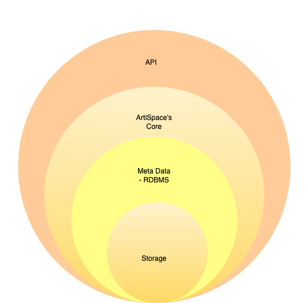

# ArtiSpace

ArtiSpace is an open-source artifact registry that supports multiple package types(under development).

## Why ArtiSpace?

The ArtiSpace is an open source focused artifact registry that intends to support popular package types.

ArtiSpace is an open-source artifact registry designed to support popular package types.

Unlike existing artifact registries, ArtiSpace prioritizes **simplicity, ease of deployment, and modern technology** . Our goal is to provide a lightweight yet powerful solution that is **developer-friendly, scalable, and efficient**

Compared to already available artifact registries, the ArtiSpace focues more on easy to deploy, simplicity and is being built on top of latest technologies.

## Architecture

ArtiSpace features a simple and layered architecture designed for clarity and scalability.
At a high level, it consists of four layers:

1. API Layer – Handles incoming requests and exposes RESTful endpoints.
2. Application Layer – Contains ArtiSpace's core logic.
3. Metadata Layer – Manages package metadata and indexing.
4. Storage Layer – Stores artifacts efficiently.

ArtiSpace is designed with user-friendly interfaces to simplify management for both developers and administrators.

## Technologies

* **Backend (Core Logic):** Golang
* **Frontend (UI):** React
* **Databases:** RDBMS for metadata storage. Initially, we are developing a**proof of concept (PoC)** with**SQLite** , with plans to extend support to**PostgreSQL** and other RDBMS solutions.
* **Storage:** The PoC will use a**local file system** , with future support planned for**S3, Azure Blob Storage, Google Cloud Storage, and NFS**
* App Logic/Core/Backend - Golang
* UI - React
* DBs : RDBMS (used for meta data storage) and intially, We intened to develop PoC with SQLite and extends to other RDMBS such as PostgreSQL later.
* Storage: PoC will be developed with Local File system. Later, We planned to support other storage backends such as S3 / Azure Blob Storage / Google Cloud Storage and NFS
